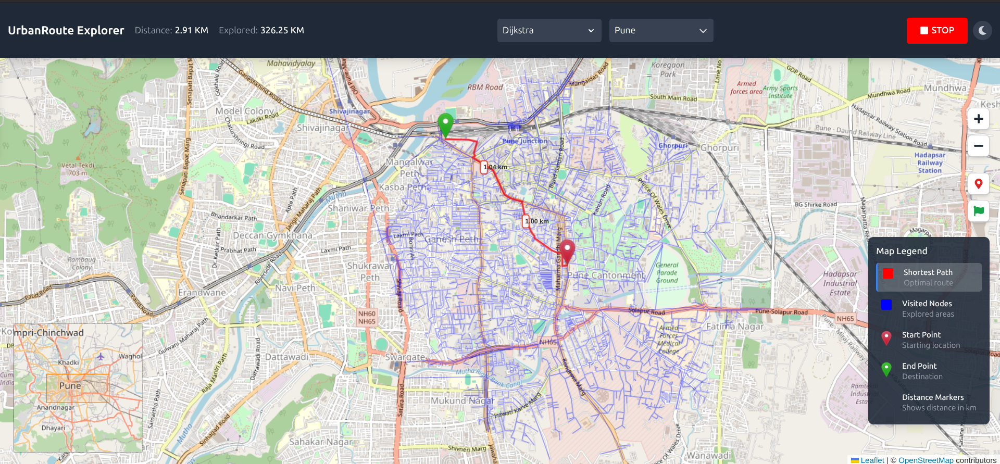
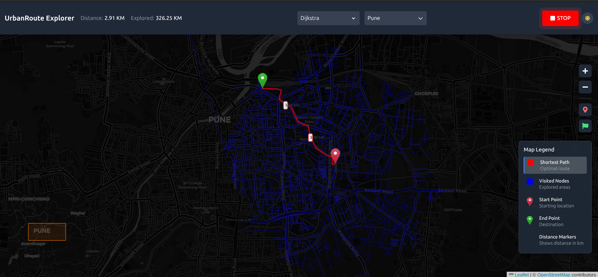

# Pathfinding Visualizer

Pathfinding Visualizer is a web application that visualizes various pathfinding algorithms to find the shortest path between a source node and an end node on a real-world map. The visualization helps in understanding how different algorithms work in finding the shortest path.




## Technologies Used

- **React.js (Vite)**: The core framework used for building the application.
- **Tailwind CSS**: Used for styling the application.
- **Leaflet Map** : Leaflet is a JavaScript library used to build web mapping applications

## Objective

To find the shortest path between the source node cell and the end node cell and visualize the process using various pathfinding algorithms.

## Algorithms Implemented

1. Dijkstra
2. A*
3. BFS (Breadth-First Search)
4. DFS (Depth-First Search)

## Features

- **Speed Options**: Users can select from three speed options - Slow, Average, and Fast.
- **Start Point**: Represented with a red play icon. The start point is draggable.
- **End Point**: Represented with a green flag. The end point is draggable.

## Installation and Setup

Follow these steps to run the project on your local machine:

### Prerequisites

- Node.js and npm should be installed on your machine. You can download them from [Node.js](https://nodejs.org/).

### Generate Nodes and Edges Data

 - Obtain an OpenStreetMap (.osm) file for your desired location.
 - Place the .osm file in the `data` directory.
 - Run the Python script to generate `nodes.json` and `edges.json` files:

### Steps

1. **Clone the Repository**

   ```bash
   https://github.com/Kabirssss/UrbanRoute-Explorer.git
   
2. **Clone the Repository**


    ```bash
    npm install
3. **Run the Development Server**

    ```bash
    npm run dev

### Usage

1. Select Algorithm: Choose an algorithm from the dropdown menu in the navigation bar.
2. Adjust Speed: Select the visualization speed from the speed dropdown menu.
3. Visualize: Click the "Visualize" button to start the algorithm visualization.
4. Clear Board: Click the "Clear Board" button to reset the Map.
5. Drag Start/End Points: Drag the marker, to set start and end point.

